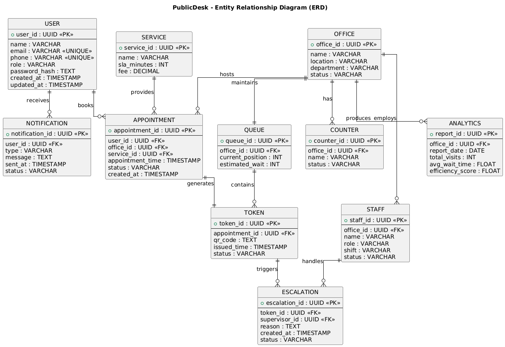

# Entity Relationship Diagram - PublicDesk

## Database Schema

This ER diagram represents the database structure and relationships between entities in the PublicDesk system.

## Key Entities

- **users**: User accounts and authentication
- **appointments**: Appointment bookings and scheduling
- **tokens**: Digital tokens with QR codes
- **queues**: Active queue management
- **counters**: Service counter configuration
- **services**: Service types and categories
- **organizations**: Multi-tenant organization data
- **notifications**: Notification logs and history
- **audit_logs**: System audit trail

## Relationships

- One User can have many Appointments
- One Appointment generates one Token
- One Queue contains many Tokens
- One Counter serves one Queue
- One Service can have many Queues
- One Organization has many Services
