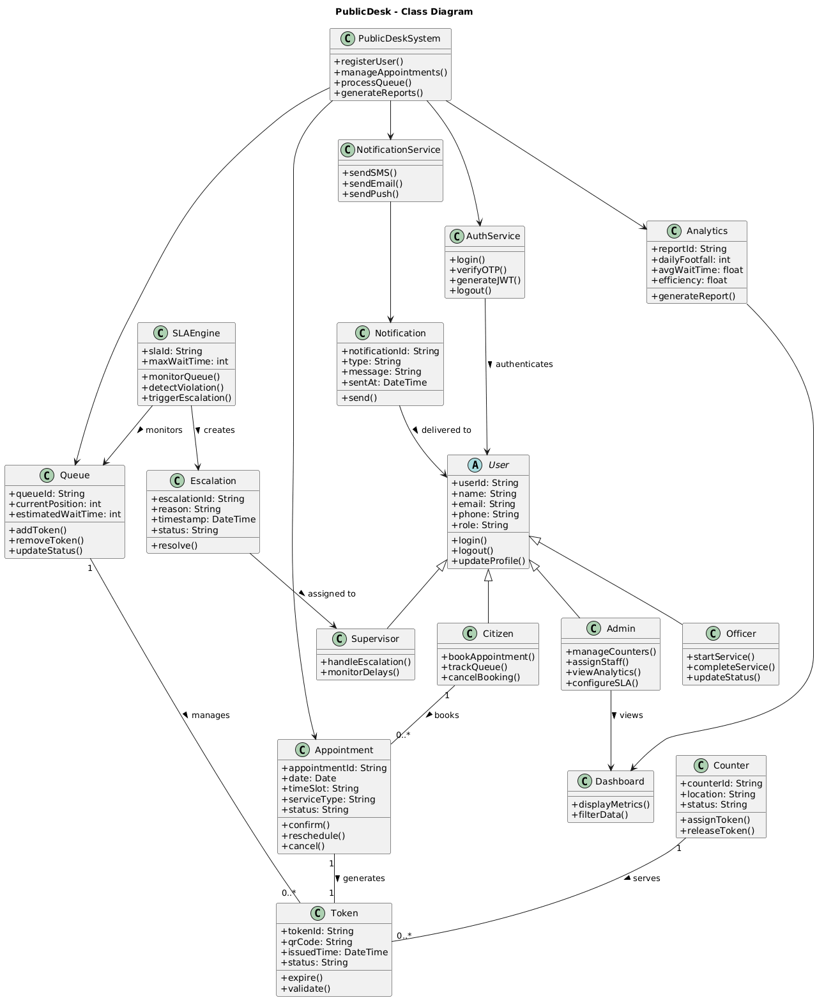

# Class Diagram - PublicDesk

## System Class Structure

This class diagram illustrates the core entities and their relationships in the PublicDesk system.

## Key Classes

- **User**: Base class for all user types (Citizen, Staff, Admin)
- **Appointment**: Manages appointment bookings and scheduling
- **Token**: Digital token with QR code for queue management
- **Queue**: Queue management and position tracking
- **Counter**: Service counter allocation and management
- **Service**: Service types offered by the organization
- **Notification**: Multi-channel notification system
