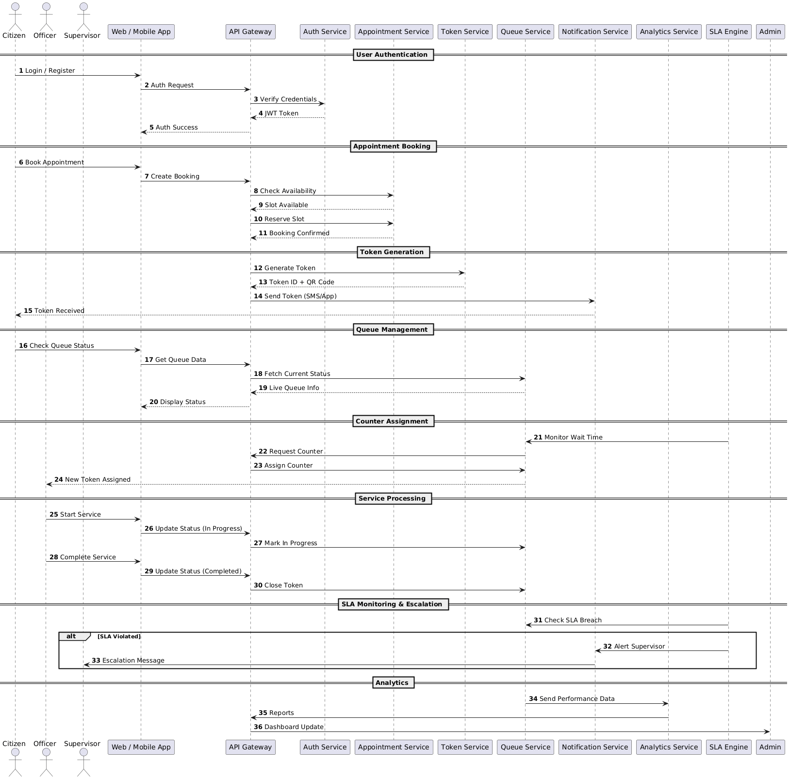

# Sequence Diagram - PublicDesk

## Appointment Booking Flow

This sequence diagram illustrates the interaction between different components during the appointment booking and token generation process.

## Flow Description

### 1. User Authentication
- User initiates login
- OTP verification
- JWT token generation

### 2. Appointment Booking
- User selects service and time slot
- System checks availability
- Appointment is created

### 3. Token Generation
- Digital token with QR code is generated
- Token is linked to appointment
- Notification sent to user

### 4. Queue Management
- User arrives and joins queue
- Real-time position updates
- Staff calls next token

### 5. Service Completion
- Token status updated
- Service metrics recorded
- Feedback request sent
