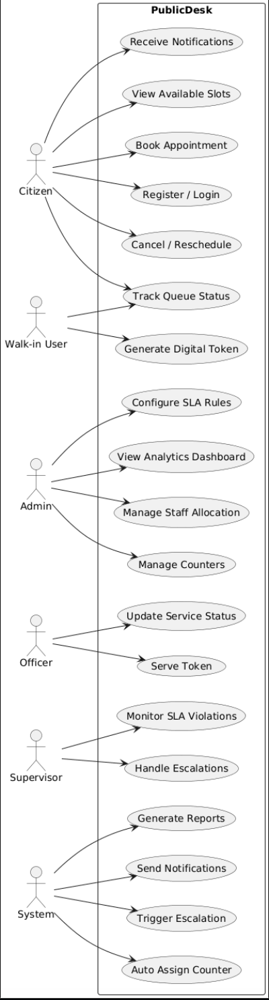

# Use Case Diagram - PublicDesk

## System Actors and Use Cases

This use case diagram shows the interactions between different actors and the PublicDesk system.

## Actors

### 1. Citizen
- Register/Login
- Book Appointment
- Generate Token
- Track Queue Position
- View Appointment History
- Receive Notifications

### 2. Staff/Counter Operator
- Login to System
- Manage Counter
- Call Next Token
- Update Service Status
- Mark Service Complete
- Handle Priority Cases

### 3. Administrator
- Manage Users
- Configure Services
- Manage Counters
- View Analytics
- Generate Reports
- Manage Organizations
- Configure SLA Rules

### 4. System
- Send Notifications
- Update Queue Status
- Generate Analytics
- Verify QR Codes
- Trigger Escalations
